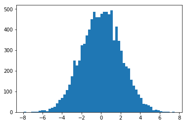
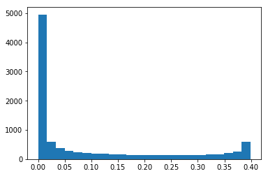

# Skewness and Kurtosis - Lab

## Introduction

In this lab, you'll calculate skewness and kurtosis for a given dataset in SciPy using Python.

## Objectives
You will be able to:

* Calculate and interpret values of skewness and kurtosis

## Bring in SciPy
In the previous lesson, you have seen formulas to calculate skewness and kurtosis for your data. SciPy comes packaged with these functions and provides an easy way to calculate these two quantities, see [scipy.stats.kurtosis](https://docs.scipy.org/doc/scipy/reference/generated/scipy.stats.kurtosis.html#scipy.stats.kurtosis) and [scipy.stats.skew](https://docs.scipy.org/doc/scipy/reference/generated/scipy.stats.skew.html). Check out the official SciPy documentation to dig deeper into this. Otherwise, simply pull up the documentation within the Jupyter notebook using `shift+tab` within the function call or pull up the full documentation with `kurtosis?` or `skew?`, once you have imported these methods from the SciPy package.

You'll generate two datasets and measure/visualize and compare their skew and kurtosis in this lab.


```python
# Import required libraries
import numpy as np
import matplotlib.pyplot as plt

from scipy.stats import kurtosis, skew
```


```python
# __SOLUTION__ 
# Import required libraries
import numpy as np
import matplotlib.pyplot as plt

from scipy.stats import kurtosis, skew
```

## Take 1
* Generate a random normal variable `x_random` in NumPy with 10,000 values. Set the mean value to 0 and the standard deviation to 2.
* Plot a histogram of the data, set bins to `auto` (default). 
* Calculate the skewness and kurtosis for this data distribution using the SciPy functions.
* Record your observations about the calculated values and the shape of the data. 


```python
x_random = None

# Skewness = -0.0025781248189666343
# kurtosis = 0.03976806960642154

```

    Skewness = -0.01442829768952485
    kurtosis = 0.016922288438713018


```python
# Your observations here 


#
#
#
```


```python
# __SOLUTION__ 
x_random = np.random.normal(0, 2, 10000)
plt.hist(x_random, bins='auto')
print ('Skewness =', skew(x_random))
print ('kurtosis =', kurtosis(x_random))
```

    Skewness = -0.02156601863073961
    kurtosis = -0.03888624629995174





```python
# __SOLUTION__ 
# Your observations here 

# Data is normally distributed (obviously) and thus symmetrical 

# A very slight negative skewness is observed as there are slightly more values on the right 
# side of distribution mean than those on left side


# The kurtosis value shows that this distribution is Platykurtic: The Kurtosis < 0 . In this implementation
# of kurtosis (Fisher's), 3 is subtracted from the Pearson kurtosis. Fisher's kurtosis is also known as excess kurtosis.

# Data is light tailed, and has no outliers. 
```

## Take 2

Let's generate another distribution 


```python
x = np.linspace( -5, 5, 10000 )
y = 1./(np.sqrt(2.*np.pi)) * np.exp( -.5*(x)**2  )  # normal distribution
```


```python
# __SOLUTION__ 
x = np.linspace( -5, 5, 10000 )
y = 1./(np.sqrt(2.*np.pi)) * np.exp( -.5*(x)**2)
```

* Plot a histogram for data $y$, and set bins to auto (default).
* Calculate the skewness and kurtosis for this data distribution using the SciPy functions.
* Record your observations about the calculated values and the shape of the data.


```python


# Skewness = 1.109511549276228
# kurtosis = -0.31039027765889804
```

    Skewness = 1.109511549276228
    kurtosis = -0.31039027765889804





```python
# Your observations here 

#
#
#
```


```python
# __SOLUTION__ 
plt.hist(y, bins='auto')
print ('Skewness =', skew(y))
print ('kurtosis =', kurtosis(y))
```

    Skewness = 1.109511549276228
    kurtosis = -0.31039027765889804


```python
# __SOLUTION__ 
# Your observations here 

# A high positive skewness is observed as there are more values on the left 
# side of the distribution mean than those on right side

# A negative kurtosis value indicates that the distribution has thinner tails 
# and a flatter peak than the normal distribution. It is platykurtic. Note that the measure of kurtosis is
# "comparing" to a normal distribution. Looking at the plot, the distribution is clearly
# not normal. Kurtosis values are really mostly useful to look at when your observed curve 
# is bell-shaped and you want to know if your tails are lighter or fatter than those of a normal distribution
```

## Summary

In this lesson we learned how to calculate, visualize, and analyze the skewness and kurtosis for any given distribution. We worked with synthetic datasets at this stage to get the concepts cleared up. Later we will try these techniques on real datasets to see if they are fit for analysis (or not). 
